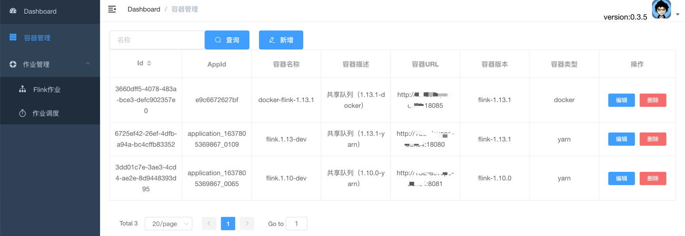
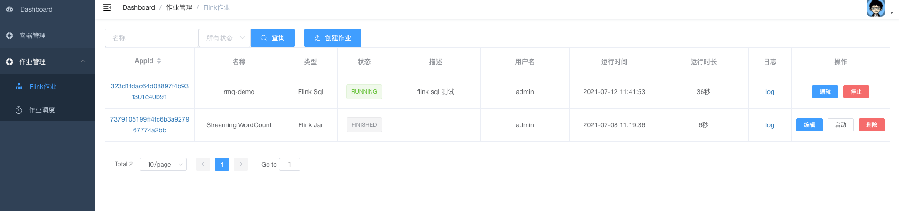
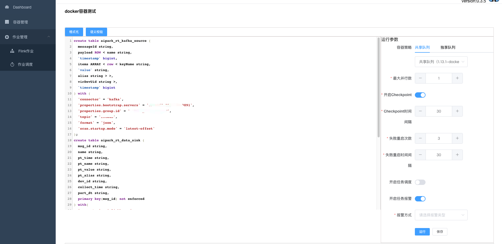
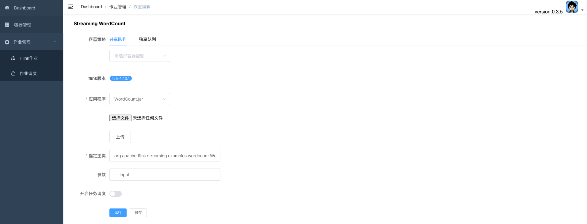

# Dpp

> 这是一个flink半托管的管理平台，可以对flink sql任务直接编辑提交运行，也可以上传jar包运行，可对任务进行停止、启动、删除等操作。

## 当前版本（0.3.5）功能

1、支持flink on yarn,flink on docker两种模式。

2、容器管理：针对yarn session和docker容器信息的管理，需要手动添加相关信息。

3、创建flink sql作业：可直接在sql编辑插件中进行编辑、sql校验、格式化、提交运行等操作。flink sql方式可以在界面上控制检查点是否开启，重启次数等操作。

4、创建flink jar作业：可上传本地打包的作业进行提交运行。

5、作业列表：可对提交的作业进行展示、停止、启动、删除、查看运行日志、flink-ui跳转等操作。

6、作业调度：针对开启了可调度的作业进行定时调度，cron表达式为Java(Spring): 0 0 */12 * * *。

7、作业支持钉钉机器人报警。

8、支持yarn session和yarn pre job 的提交方式。

## 项目部署
#### 1、首先确保服务器可访问自建的hadoop-yarn相关环境或flink on docker环境。

#### 2、执行init.sh脚本：
```bash
#!/bin/bash

mkdir -p /data/flink/jar/jobs
cd /data/flink
wget flink-1.13.1.tar.gz(flink运行环境)
tar -zxvf flink-1.13.1.tar.gz
cd /data/flink/flink-1.13.1/bin
bash historyserver.sh start
```

#### 3、运行docker-compose.yml脚本
```bash
version: '3'
services:
  dpp-pgsql:
    image: postgres:12.4
    container_name: dpp-pgsql
    restart: always
    volumes:
      - /data/pgsql-database:/var/lib/postgresql/data
    environment:
      POSTGRES_USER: postgres
      POSTGRES_PASSWORD: 123456
    networks:
      cdh-network:
         ipv4_address: *.*.*.* 
    deploy:
     resources:
        limits:
           cpus: '2'
           memory: 4G

  dpp-service:
    image: dztstudio/dpp-service:dev-0.3.5
    container_name: dpp-service
    restart: always
    environment:
      DAPHOST_HOST: *.*.*.*
      DAPHOST_PASSWORD: *****
      DAPHOST_PORT: 22
      DAPHOST_USER: root
      JDBC_URL: jdbc:postgresql://*.*.*.*:5432/postgres?user=postgres&password=123456&useUnicode=true&characterEncoding=utf-8&useSSL=true
    ports:
      - "8083:8083"
    networks:
      cdh-network:
        ipv4_address: *.*.*.*
    deploy:
     resources:
        limits:
           cpus: '2'
           memory: 4G

  dpp-front:
    image: dztstudio/dpp-front:dev-0.3.5
    container_name: dpp-front
    restart: always
    environment:
      VUE_APP_BASE_API: http://dpp_host:8083
    ports:
      - "9528:9528"
    networks:
      cdh-network:
        ipv4_address: *.*.*.*
    deploy:
     resources:
        limits:
           cpus: '2'
           memory: 4G
    
networks:
  cdh-network:
    external: true
```
其中，DAPHOST相关的环境变量为服务器22端口的鉴权信息。其他配置可根据情况调整。

#### 4、初始化元数据信息
到psql控制台中执行以下sql脚本,脚本地址：https://github.com/dzt-studio/dpp-service/blob/master/ddl/create-ddl.sql。

然后访问http://localhost:9528

账号：admin  
密码：123456

DPP平台交流QQ群：739219754



