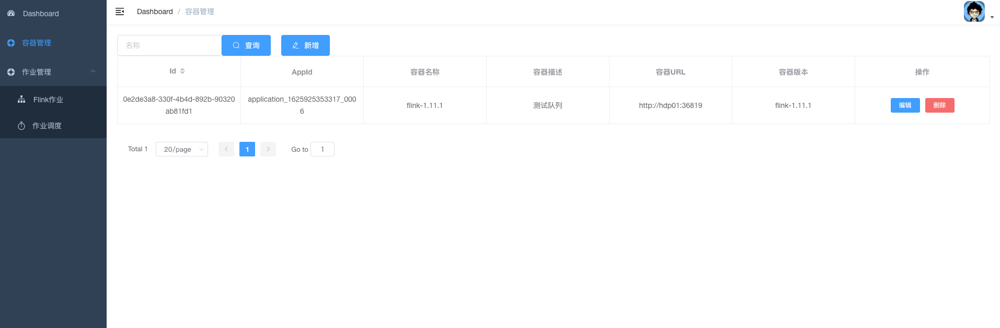
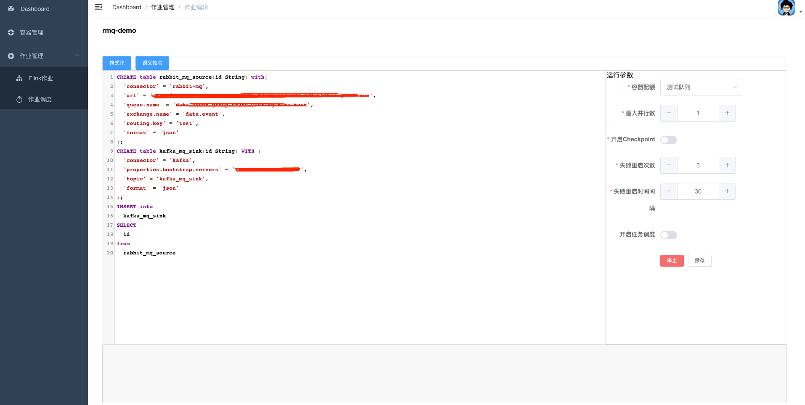

# Dzt-Dpp

> 这是一个flink半托管的管理平台，可以对flink sql任务直接编辑提交运行，也可以上传jar包运行，可对任务进行停止、启动、删除等操作。

## 当前版本（0.1.1）功能

1、目前只支持flink on yarn模式。

2、容器管理：针对yarn application的信息管理。注意，该功能并不能直接创建flink yarn session。

3、创建flink sql作业：可直接在sql编辑插件中进行编辑、sql校验、格式化、提交运行等操作。flink sql方式可以在界面上控制检查点是否开启，重启次数等操作。

4、创建flink jar作业：可上传本地打包的作业进行提交运行。

5、作业列表：可对提交的作业进行展示、停止、启动、删除、查看运行日志、flink-ui跳转等操作。

6、作业调度：针对开启了可调度的作业进行定时调度，cron表达式为Java(Spring): 0 0 */12 * * *。

## 后期功能计划

1、可配置异常任务报警推送。

2、可配置异常任务自动重启（非flink的重启机制）。

3、可配置定时savepoint。

4、dashboard页面展示页。

5、后续还会开放一些自定义的flink sql connector插件。

6、帮助文档计划。

7、增加spark托管等。

## 项目部署
#### 1、首先确保服务器可访问自建的hadoop-yarn相关环境。

#### 2、执行init.sh脚本：
```bash
#!/bin/bash
sudo mkdir -p /data/flink/jar/jobs
cd /data/flink/jar/
wget https://github.com/dzt-studio/dpp-service/raw/master/lib/dap-plug-1.0-SNAPSHOT.jar
```
该脚本主要是创建指定目录，导入相关插件，后续不同的flink版本运行环境都要解压到data目录下面，如/data/flink-1.11.1。

#### 3、运行docker-compose.yml脚本
```bash
version: "3"

services:
  dpp-db:
    image: postgres:12
    restart: always
    ports:
      - 5432:5432
    environment:
      POSTGRES_PASSWORD: 123456
  dpp-front:
    image: dztstudio/dpp-front:dev-0.1.0     
    restart: always
    ports:
      - 9528:9528
    environment:
      VUE_APP_BASE_API: http://localhost:8083
  dpp-service:
    image: dztstudio/dpp-service:dev-0.1.0
    restart: always
    ports:
      - 8083:8083
    environment:
      DAPHOST_HOST: 127.0.0.1
      DAPHOST_PASSWORD: *******
      DAPHOST_PORT: 22
      DAPHOST_USER: root
      JDBC_URL: jdbc:postgresql://localhost:5432/dpp_v2?user=postgres&password=123456&useUnicode=true&characterEncoding=utf-8&useSSL=true
      SERVER_PORT: 8083
```
其中，DAPHOST相关的环境变量为服务器22端口的鉴权信息。其他配置可根据情况调整。

#### 4、初始化元数据信息
到psql控制台中执行以下sql脚本。
```sql
create extension "uuid-ossp";

create table if not exists dpp_app_jars
(
    id text not null
        constraint dpp_app_jars_pk
            primary key,
    jar_name text,
    created_at timestamp with time zone,
    updated_at timestamp with time zone
);

create table if not exists dpp_container_info
(
    id text not null
        constraint dpp_container_info_pk
            primary key,
    container_id text,
    container_name text,
    container_url text,
    container_msg text,
    container_version text
);

comment on table dpp_container_info is '容器配置表';

create table if not exists dpp_job_config
(
    id text default uuid_generate_v4() not null
        constraint dpp_job_config_pk
            primary key,
    parallelism integer,
    checkpoint_enable boolean,
    checkpoint_interval integer,
    restart_strategy_count smallint,
    restart_strategy_time integer,
    sql_details text,
    job_id text not null
);

comment on table dpp_job_config is '任务配置表';

comment on column dpp_job_config.parallelism is '并行度';

comment on column dpp_job_config.checkpoint_enable is '检查点开关';

comment on column dpp_job_config.checkpoint_interval is '检查点间隔时间';

comment on column dpp_job_config.restart_strategy_count is '任务异常重启次数';

comment on column dpp_job_config.restart_strategy_time is '任务异常重启间隔时长';

comment on column dpp_job_config.sql_details is 'flinksql详情';

comment on column dpp_job_config.job_id is '任务id';

create unique index if not exists dpp_job_config_job_id_uindex
    on dpp_job_config (job_id);

create table if not exists dpp_job_list
(
    id text default uuid_generate_v4() not null
        constraint dpp_job_list_pk
            primary key,
    job_name text not null,
    job_status text,
    start_time timestamp with time zone,
    run_time bigint,
    container_id text,
    last_check_point_address text,
    describes text,
    enable_schedule boolean,
    job_type text,
    jar_name text,
    app_params text,
    main_class text,
    fv text,
    created_by text,
    created_at timestamp with time zone,
    updated_by text,
    updated_at timestamp with time zone,
    app_id text
);

comment on table dpp_job_list is '任务表';

comment on column dpp_job_list.job_name is '任务名称';

comment on column dpp_job_list.job_status is '任务状态';

comment on column dpp_job_list.start_time is '任务开始时间';

comment on column dpp_job_list.run_time is '任务运行时长';

comment on column dpp_job_list.container_id is '容器id';

comment on column dpp_job_list.last_check_point_address is '最近一次检查点';

comment on column dpp_job_list.describes is '描述';

comment on column dpp_job_list.enable_schedule is '是否开启调度';

comment on column dpp_job_list.job_type is '任务类型';

comment on column dpp_job_list.jar_name is 'jar包名字';

comment on column dpp_job_list.app_params is '运行参数';

comment on column dpp_job_list.main_class is '主类';

comment on column dpp_job_list.fv is 'flink版本号';

comment on column dpp_job_list.app_id is '集群任务id';

create unique index if not exists dpp_job_list_job_name_uindex
    on dpp_job_list (job_name);

create table if not exists dpp_job_log
(
    job_id text not null
        constraint dpp_job_log_pk
            primary key,
    log_info text
);

comment on table dpp_job_log is '任务日志';

create unique index if not exists dpp_job_log_job_id_uindex
    on dpp_job_log (job_id);

create table if not exists dpp_job_scheduled
(
    id text not null
        constraint dpp_job_scheduled_pk
            primary key,
    job_name text,
    cron text,
    created_by text,
    created_at timestamp with time zone,
    updated_by text,
    updated_at timestamp with time zone,
    is_open boolean,
    job_type text
);

create table if not exists dpp_user
(
    id text not null
        constraint dpp_user_pk
            primary key,
    user_name text,
    password text,
    created_at timestamp with time zone default now(),
    updated_at timestamp with time zone default now()
);

comment on table dpp_user is '用户表';

insert into dpp_user (id, user_name, password, created_at, updated_at)
values ('c7cb6921-b51f-4759-80cf-c1d766e8d01d','admin','123456','2021-06-21 08:44:33','2021-06-21 08:44:33'
);
```
然后访问http://localhost:9528 就可以了

账号：admin  
密码：123456




